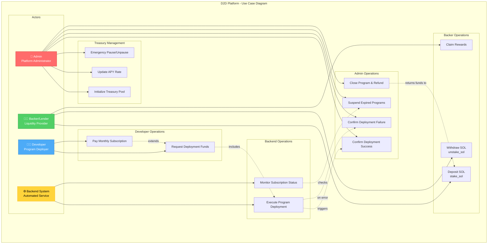
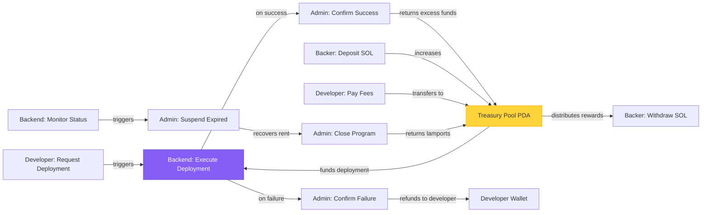
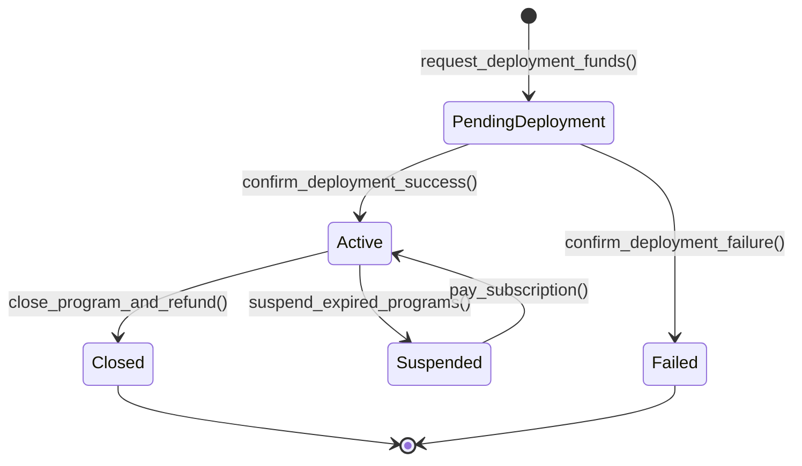

# D2D Platform - Use Case Diagram

## 🎯 Overview

This document describes all use cases in the D2D (Developer-to-Developer) Platform, which enables developers to deploy Solana programs funded by a community lending pool.

---

## 📊 Use Case Diagram

---

## 🔄 Use Case Flow Diagram

---

## 👥 Actors

| Actor | Role | Description |
|-------|------|-------------|
| **Admin** 👤 | Platform Administrator | Manages treasury pool, confirms deployments, handles expired programs |
| **Developer** 👨‍💻 | Program Deployer | Deploys Solana programs, pays fees and subscriptions |
| **Backer/Lender** 🧑‍💰 | Liquidity Provider | Stakes SOL into pool, earns APY rewards |
| **Backend System** ⚙️ | Automated Service | Executes deployments, monitors subscriptions |

---

## 📋 Use Case Specifications

### 1️⃣ Admin Use Cases

#### UC1: Initialize Treasury Pool
- **Actor**: Admin
- **Instruction**: `initialize(initial_apy, treasury_wallet)`
- **Description**: Initialize the D2D program and create the Treasury Pool PDA with initial APY rate
- **Preconditions**: Program not yet initialized
- **Postconditions**: Treasury Pool PDA created, system ready for operation
- **Flow**:
  1. Admin calls initialize with initial APY (e.g., 1000 = 10%)
  2. System creates Treasury Pool PDA
  3. System emits `TreasuryInitialized` event

#### UC2: Update APY Rate
- **Actor**: Admin
- **Instruction**: `update_apy(new_apy)`
- **Description**: Update the APY rate for backer rewards
- **Preconditions**: Treasury Pool initialized
- **Postconditions**: New APY applied to future rewards
- **Flow**:
  1. Admin calls update_apy with new rate
  2. System validates admin signature
  3. System updates treasury_pool.current_apy
  4. System emits `ApyUpdated` event

#### UC3: Emergency Pause/Unpause
- **Actor**: Admin
- **Instruction**: `emergency_pause(pause: bool)`
- **Description**: Pause or unpause all system operations in case of emergency
- **Preconditions**: Treasury Pool initialized
- **Postconditions**: System paused/unpaused
- **Flow**:
  1. Admin calls emergency_pause with true/false
  2. System sets treasury_pool.emergency_pause flag
  3. All operations check this flag before executing

#### UC9: Confirm Deployment Success
- **Actor**: Admin (triggered by Backend)
- **Instruction**: `confirm_deployment_success(request_id, deployed_program_id)`
- **Description**: Confirm successful deployment and return excess funds to Treasury Pool
- **Preconditions**: Deployment request in PendingDeployment status
- **Postconditions**: Request status = Active, excess funds returned
- **Flow**:
  1. Backend deploys program successfully
  2. Admin calls confirm_deployment_success
  3. System updates deploy_request.status = Active
  4. System transfers remaining SOL from ephemeral key to Treasury Pool
  5. System emits `DeploymentConfirmed` event

#### UC10: Confirm Deployment Failure
- **Actor**: Admin (triggered by Backend)
- **Instruction**: `confirm_deployment_failure(request_id, failure_reason)`
- **Description**: Handle deployment failure and refund developer
- **Preconditions**: Deployment request in PendingDeployment status
- **Postconditions**: Request status = Failed, funds refunded
- **Flow**:
  1. Backend deployment fails
  2. Admin calls confirm_deployment_failure
  3. System updates deploy_request.status = Failed
  4. System returns deployment_cost to developer
  5. System emits `DeploymentFailed` event

#### UC11: Suspend Expired Programs
- **Actor**: Admin (triggered by Backend monitoring)
- **Instruction**: `suspend_expired_programs()`
- **Description**: Automatically suspend programs with expired subscriptions
- **Preconditions**: Deploy requests with subscription_paid_until < current_time
- **Postconditions**: Expired programs suspended
- **Flow**:
  1. Backend monitors subscription status
  2. Admin calls suspend_expired_programs
  3. System updates deploy_request.status = Suspended
  4. System emits `ProgramSuspended` event

#### UC12: Close Program & Refund
- **Actor**: Admin
- **Instruction**: `close_program_and_refund(request_id, recovered_lamports)`
- **Description**: Close a deployed program and return recovered rent to Treasury Pool
- **Preconditions**: Deploy request in Active status
- **Postconditions**: Request closed, lamports returned to pool
- **Flow**:
  1. Admin closes program on Solana
  2. Admin calls close_program_and_refund with recovered lamports
  3. System updates deploy_request.status = Closed
  4. System transfers recovered lamports to Treasury Pool
  5. System increases treasury_pool.total_staked
  6. System emits `ProgramClosed` event

---

### 2️⃣ Developer Use Cases

#### UC7: Request Deployment Funds
- **Actor**: Developer
- **Instruction**: `request_deployment_funds(program_hash, service_fee, monthly_fee, initial_months, deployment_cost)`
- **Description**: Developer pays fees and requests SOL from pool to deploy program
- **Preconditions**: 
  - Treasury Pool has sufficient funds
  - Developer has SOL for fees
- **Postconditions**: 
  - Deploy request created
  - Ephemeral key funded with deployment_cost
- **Flow**:
  1. Developer calls request_deployment_funds
  2. System validates treasury_pool.total_staked >= deployment_cost
  3. System transfers (service_fee + monthly_fee * initial_months) from developer to Treasury Pool PDA
  4. System transfers deployment_cost from Treasury Pool to ephemeral key
  5. System creates deploy_request with status = PendingDeployment
  6. System emits `DeploymentFundsRequested` event
  7. Backend executes deployment using ephemeral key

#### UC8: Pay Monthly Subscription
- **Actor**: Developer
- **Instruction**: `pay_subscription(request_id, months)`
- **Description**: Extend subscription for an active deployed program
- **Preconditions**: Deploy request exists and not suspended
- **Postconditions**: Subscription extended
- **Flow**:
  1. Developer calls pay_subscription
  2. System calculates payment = monthly_fee * months
  3. System transfers payment from developer to Treasury Pool
  4. System extends deploy_request.subscription_paid_until
  5. System emits `SubscriptionPaid` event

---

### 3️⃣ Backer Use Cases

#### UC4: Deposit SOL (Stake)
- **Actor**: Backer/Lender
- **Instruction**: `stake_sol(amount, lock_period)`
- **Description**: Backer deposits SOL into Treasury Pool to earn APY rewards
- **Preconditions**: System not paused
- **Postconditions**: 
  - SOL deposited
  - Backer deposit record created
- **Flow**:
  1. Backer calls stake_sol with amount and lock_period
  2. System transfers SOL from backer to Treasury Pool PDA
  3. System creates/updates BackerDeposit (lender_stake) account
  4. System updates treasury_pool.total_staked
  5. System emits `StakeDeposited` event

#### UC5: Withdraw SOL (Unstake)
- **Actor**: Backer/Lender
- **Instruction**: `unstake_sol(amount)`
- **Description**: Backer withdraws SOL plus rewards from Treasury Pool
- **Preconditions**: 
  - Backer has deposited SOL
  - Lock period expired (if applicable)
- **Postconditions**: SOL + rewards transferred to backer
- **Flow**:
  1. Backer calls unstake_sol
  2. System calculates rewards with duration bonus
  3. System validates treasury_pool.total_staked >= (amount + rewards)
  4. System transfers (amount + rewards) from Treasury Pool to backer
  5. System updates treasury_pool.total_staked
  6. System updates BackerDeposit record
  7. System emits `StakeWithdrawn` event

#### UC6: Claim Rewards
- **Actor**: Backer/Lender
- **Instruction**: `claim_rewards()`
- **Description**: Backer claims accumulated rewards without withdrawing principal
- **Preconditions**: Backer has deposited SOL and rewards > 0
- **Postconditions**: Rewards transferred, principal remains staked
- **Flow**:
  1. Backer calls claim_rewards
  2. System calculates accumulated rewards
  3. System transfers rewards from Treasury Pool to backer
  4. System updates treasury_pool.total_rewards_distributed
  5. System emits `RewardsClaimed` event

---

### 4️⃣ Backend Use Cases

#### UC13: Execute Program Deployment
- **Actor**: Backend System
- **Triggered by**: UC7 (Request Deployment Funds)
- **Description**: Backend executes actual program deployment using Web3.js
- **Preconditions**: 
  - Deploy request created
  - Ephemeral key funded
- **Postconditions**: 
  - Program deployed on Solana
  - Admin confirms success/failure
- **Flow**:
  1. Backend receives DeploymentFundsRequested event
  2. Backend loads ephemeral keypair
  3. Backend deploys program using `@solana/web3.js`
  4. Backend transfers program authority to D2D admin
  5. Backend calls confirm_deployment_success or confirm_deployment_failure

#### UC14: Monitor Subscription Status
- **Actor**: Backend System
- **Description**: Periodic monitoring of subscription expiration
- **Preconditions**: Active deploy requests exist
- **Postconditions**: Expired programs suspended
- **Flow**:
  1. Backend runs periodic check (e.g., daily)
  2. Backend queries all active deploy requests
  3. Backend identifies requests with subscription_paid_until < current_time
  4. Backend triggers UC11 (Suspend Expired Programs)
  5. Backend notifies developers via email/notification

---

## 🔗 Use Case Relationships

| Relationship | From | To | Type |
|--------------|------|-----|------|
| Triggers | UC7: Request Deployment Funds | UC13: Execute Deployment | Include |
| Triggers | UC13: Execute Deployment | UC9: Confirm Success | Conditional |
| Triggers | UC13: Execute Deployment | UC10: Confirm Failure | Conditional |
| Returns funds | UC12: Close Program | UC4: Deposit (Pool) | Include |
| Monitors | UC14: Monitor Status | UC11: Suspend Expired | Trigger |
| Extends | UC8: Pay Subscription | UC7: Request Deployment | Extend |

---

## 🔐 Access Control Matrix

| Use Case | Admin | Developer | Backer | Backend |
|----------|-------|-----------|--------|---------|
| Initialize Treasury Pool | ✅ | ❌ | ❌ | ❌ |
| Update APY | ✅ | ❌ | ❌ | ❌ |
| Emergency Pause | ✅ | ❌ | ❌ | ❌ |
| Deposit SOL | ❌ | ❌ | ✅ | ❌ |
| Withdraw SOL | ❌ | ❌ | ✅ | ❌ |
| Claim Rewards | ❌ | ❌ | ✅ | ❌ |
| Request Deployment | ❌ | ✅ | ❌ | ❌ |
| Pay Subscription | ❌ | ✅ | ❌ | ❌ |
| Confirm Deployment | ✅ | ❌ | ❌ | 🔶 (triggers) |
| Suspend Expired | ✅ | ❌ | ❌ | 🔶 (triggers) |
| Close Program | ✅ | ❌ | ❌ | ❌ |
| Execute Deployment | ❌ | ❌ | ❌ | ✅ |
| Monitor Status | ❌ | ❌ | ❌ | ✅ |

**Legend**: ✅ Direct access | ❌ No access | 🔶 Indirect trigger

---

## 📈 Success Metrics

| Use Case | Success Criteria | KPI |
|----------|------------------|-----|
| Request Deployment Funds | Funds transferred, request created | # of deployment requests |
| Execute Deployment | Program deployed, authority transferred | Deployment success rate (%) |
| Deposit SOL | SOL staked, rewards calculated | Total Value Locked (TVL) |
| Withdraw SOL | Rewards paid accurately | APY distributed (%) |
| Close Program | Rent recovered to pool | Recovered lamports (SOL) |

---

## 🔄 State Transitions

### Deploy Request Status

---

## 📝 Notes

- **Treasury Pool PDA**: Program-derived account that holds all SOL
- **Ephemeral Key**: Temporary keypair generated per deployment for signing
- **APY Rewards**: Calculated based on deposit duration and pool performance
- **Subscription Model**: Monthly recurring payments to keep programs active
- **Authority Transfer**: Deployed programs are owned by D2D admin for management

---

## 🚀 Future Use Cases (Planned)

- [ ] **UC15**: Multi-signature approval for large deployments
- [ ] **UC16**: Governance voting for APY changes
- [ ] **UC17**: NFT-based deposit receipts
- [ ] **UC18**: Auto-renewal subscription with developer wallet
- [ ] **UC19**: Backer rewards dashboard
- [ ] **UC20**: Program analytics and usage tracking

---

**Generated**: 2025-11-07  
**Program ID**: `Hn6enqRbfjQywqVbkNNFe6rauWjQLvea8Fyh6fZZPpA8`  
**Network**: Solana Devnet

